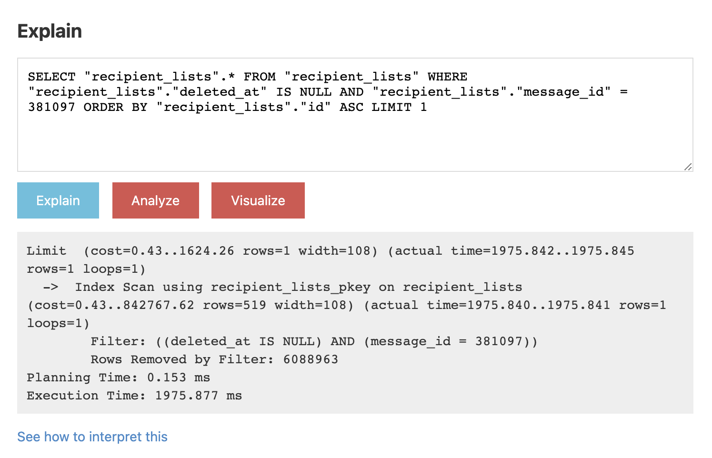
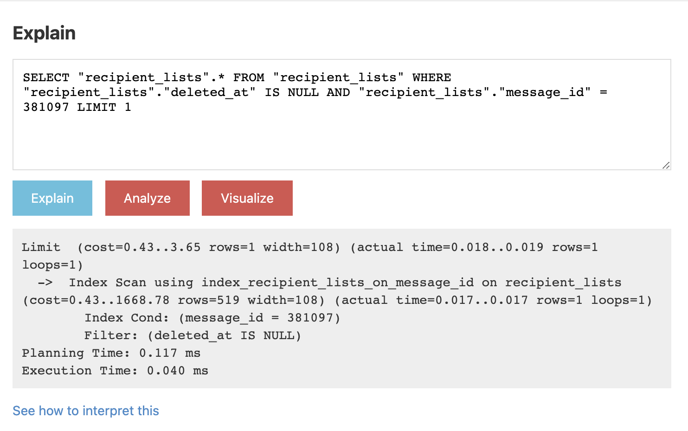

## О проекте

OneMob - маркетинговый инструмент, позволяющий эффективно делиться информацией. Это если в двух словах.

### Основной функционал
- Приложение позволяет пользователю создать свою библиотеку контента (видео, документы, ссылки, изображения).
- Приложение предоставляет инструменты для загрузки контента, а также полноценный браузерный видео-рекордер
  и инструменты редактирования видео.
- На основе контента пользователь довольно легко может создавать простые лэндинг пэйджы.
- Далее на основе лендинг пейджа создается Campaign - кампания.
- Пользователь может делиться кампанией путем отправки имэйла с линком или через любые источники
  (соц. сети, вебсайты, мессенджеры) просто используя линк на кампанию.
- Все просмотры и активности на странице кампании отслеживаются, составляется детальная статистика.

Проекту порядка 7 или 8 лет, много легаси, 4 версии api, 2 мобильных приложения.
В Web версии использован подход SPA.
В данный момент мы в процессе глобального обновления: переезжаем со старого angular на react,
полностью обновляем интерфейс, пересматриваем весь функционал. Это в свою очередь требует новой версии бэкэнда
(api, сериалайзеры, операции итп). Миграция завершена примерно на 80% - 90%.
Ввиду этого, полномасштабной оптимизацией в данный момент заниматься нет смысла, т.к в теории большая часть
старого кода будет удалена, запросы переделаны, вероятно возникнут абсолютно другие точки роста.

Кейсы оптимизации в основном связаны с самыми проблемными местами старого приложения, которые не терпят ожидания,
оптимизацией энвайромента.
Также часть нового кода была пересмотрена с учетом оптимальности подхода.

Над проектом я работаю порядка 5 лет, в основном как full-stack разработчик, последние полгода - как tech lead.

### Основными техническими проблемами приложения в данный момент я вижу:
- Большой объем легаси кода, который практически закрыт для принципиальных изменений, который довольно сложно поддерживать.
- Из за переезда и одновременного существования 2 приложений (angular и react) assets_pack просто огромный.
  После завершения миграции нас ждет глобальная чистка.
- Множество сложных и неоптимальных запросов. Ввиду разросшейся базы с некоторыми из них все чаще начинают возникать проблемы.
- Недостаточный объем собираемых метрик

## Проделанная оптимизация

Для начала было установлено несколько инструментов для сбора метрик: `PGHERO`,
`rack_mini_profiler` (подключен в т.ч в production), `memory_profiler`.
Установка `NewRelic` была отложена до релиза новой версии, т.к в данный момент это требует ресурсов (в т.ч времени),
к тому же нет смысла собирать данные со старого приложения.

### Case 1

Проблема: landing_page приложения загружается довольно долго, пользователи вряд ли будут счастливы ждать.

Решение:
- Проверил страницу с помощью WebPageTest, по результатам проверки выяснилось, что 82% загружаемого контента - изображения.
- С помощью встроенных инструментов WebPageTest оптимизировал большинство тяжеловесных изображений
- Объем изображений значительно сократился, страница стала грузиться ощутимо быстрее. К сожалению конкретных метрик не сохранилось.
- Т.к landing_page построен на react с клиентским рендерингом - не нашел пути использовать http/2 server-push для данного случая

### Case 2

Проблема: QA и служба поддержки сообщили о проблеме - некоторые конкретные части приложения начали сильно тормозить.

Решение:
- Соответствующие страницы и функционал были проверены с помощью `rack-mini-profiler`
- Профайлер показал, что один из запросов, на первый взгляд довольно легкий, выполняется экстремально долго (порядка 3 сек).
  

- Для начала я решил проверить для чего он вообще нужен и исследовал код. Оказалось что запрос вызывается из сериалайзера,
  сериалайзер при этом использован в нескольких местах и в зависимости от ситуации некоторые данные из него вообще не нужны.
  Убрал этот запрос из случаев в которых он не нужен - время в этих случаях сократилось до нуля.
- Тем не менее запрос все еще выполнялся в других местах с тем же болезненным эффектом. Было принято решение проанализировать его.
- pg analyze показал что все необходимые индексы присутствуют и используются, на первый взгляд оптимизировать оказалось нечего.
  

- Поэкспериментировав с запросом обнаружилось, что дело в сортировке. Убрал сортировку и время на запрос сократилось с 2-3сек до 0.04мс.
- Изучение кода создающего запрос показало, что сортировка там не имеет никакой необходимости:
  нужно получить связанную через has_many запись, но в случаях когда это требуется запись всегда одна, соответственно нечего и сортировать.
- Запрос осуществлялся таким образом: `object.recipient_lists.first`. Оказалось что `.first` добавляет к запросу сортировку.
  Заменил `.first` на `.take` - проблема решена, запрос исчез из топа pghero.
  

### Case 3

Проблема: как я говорил ранее, одной из главных проблем приложения являются медленные запросы в базу.
При одном и том же наполнении базы некоторые запросы пролетают мигом локально, но висят в продакшне.

Решение:
  - Последовав одной из рекомендаций курса мы решили обновить версию postgres, c 12 на 14.
  - Обновление не удалось с первого раза. Проводили мы его с помощью встроенного скрипта aws.
    Некоторые запросы которые работали быстро на старой версии стали отваливаться по таймауту после обновления. Откатились.
  - Второй раз обновились вручную, пошагово. После обновления проследовали инструкциям оптимизации базы под новую версию.
  - В результате время всех запросов на сервере сократилось примерно вдвое. Графика метрики у нас пока нет, но проверка через
    rack-mini-profiler для аналогичных страниц показала примерно такие результаты:

До:

После:

### Case 4

Проблема: во время отладки одной из страниц в отчетах rack-mini-profiler заметил, что при каждом переходе между
react-роутами выполняется один и тот же запрос, который явно так себя вести не должен

Решение:
- Исследование показало что это notification bell - компонент показывающий количество непрочитанных нотификаций.
- Запрос на получение количества нотификаций должен выполняться только при первом рендеринге приложения, в дальнейшем значение обновляется через вебсокеты.
- Дальнейшее разбирательство показало, что компонент спроектирован неверно. Он перерендеривается при каждой смене страницы.
  К тому же он пересоздает ws подключение также каждый раз при смене роута
- Вынес функционал получения значения в более глобальный компонент со схожим функционалом - проблема решена.
- rack-mini-profiler помогает не допускать подобных ошибок.

### Case 5

Проблема: один из запросов стал отрабатывать слишком медленно, периодически отваливаться по таймауту.

Решение:
- К сожалению на данном этапе архитектура фичи такова, что кардинально ускорить запрос невозможно.
- Суть запроса заключается в получении записей (items), которые расшарены с конкретным пользователем (имеют permissions).
  Permissions хранятся в 4 разных таблицах, которые по сути своей являются jointables.
  Cоответственно запрос включает в себя left_join 4-х таблиц с условиями.
- Разбил запрос на несколько отдельных запросов:
  получание item_ids из каждой таблицы permissions: 4 довольно легких запроса, а затем получение
  items по ids - запрос тоже более легковесный, несмотря на длинный список ids.
- В результате время запроса сократилось примерно вдвое в продакшне
- Вероятно с ростом базы новый запрос лучше защищен от деградации

### Case 6

Проблема: тестовый билд в CI и локально длится порядка 4 минут при наличии параллелизма.
Решение:
- Удаление DatabaseCleaner-а позволило ускорить прохождение тестов до ~2 минут.
- Более выраженный эффект наблюдается при большем количестве потоков (4), но все равно полезно.
- В дальнейшем планируем оптимизировать код тестов

### Extra

- Мониторинг pghero показал несколько отсутствующих или не оптимально работающих индексов.
  Поправили почти все, что позволило даже исключить некоторые запросы из топа.
- Экспериментируем с настройками postgres, количеством воркеров puma, мощностью инстансов, сетевыми настройками.
  Финальных результатов пока нет.
- Опыт полученный в рамках курса позволил грамотнее проектировать новый код:
  В приложение добавлен bullet и rack-mini-profiler, которые в совокупности позволяют сразу строить оптимальные запросы,
  а не оптимизировать постфактум.
- Новые запросы в базу стараемся строить таким образом чтобы получать только необходимые данные,
  что позволяет экономить память и облегчает сами запросы.
- На участках кода где можно спрогнозировать высокое потребление памяти периодически провожу профилирование с помощью memory_profiler,
  что позволяет выбрать наиболее выигрышный подход в каждом из случаев.
- Стараемся исключать конструкции излишне потребляющие память и аллоцирующие дополнительные объекты.

### Планы

- Значительно сократить объем javascript за счет удаления старого кода, старых неиспользуемых библиотек
  либо же замены на более актуальные и маловесные, оптимизация загрузки. Как избавимся от легаси - проведем профилирование.
- Профилирование гемов. После завершения миграции пересмотрим используемые гемы, возможно что то удастся убрать.
- Установка и настройка NewRelic или аналогагичного решения для сбора метрик
- Профилирование и устранение оставшихся точек роста по базе и памяти.
